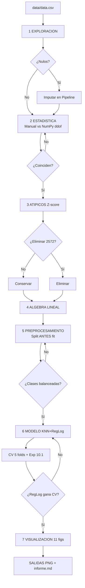

# Clasificación del nivel de ingreso de los países con fundamentos de IA

Proyecto educativo de Python que recorre la cadena completa de un problema de
**Machine Learning**: explora un dataset macroeconómico de 10.512 registros
(220 países, 1970-2021), calcula estadística y álgebra lineal a mano, detecta
valores atípicos, entrena dos clasificadores (KNN y regresión logística) y
genera 11 gráficos y un informe técnico. El objetivo es **predecir el nivel de
ingreso de un país** (bajo / medio / alto) a partir de sus agregados
macroeconómicos.

## Camino rápido

1. Instalar las dependencias en un entorno virtual (bloque de abajo).
2. Ejecutar `python main.py` desde la raíz del proyecto.
3. Ejecutar `pytest` y comprobar que los 22 tests pasan.

## Diagrama de flujo del pipeline

El siguiente diagrama muestra el proceso completo de las 7 etapas que ejecuta `main.py` en orden secuencial. Cada etapa produce salidas que alimentan a la siguiente.



## Requisitos previos

| Requisito | Versión mínima |
|-----------|----------------|
| Python    | 3.14 o superior |
| pip       | 26 o superior |
| Sistema   | Windows, Linux o macOS (las rutas usan `pathlib`) |

No hace falta instalar nada más: `pandas`, `numpy`, `scikit-learn`,
`matplotlib`, `seaborn` y `pytest` se instalan en el paso siguiente.

## Instalación (Windows / PowerShell)

```powershell
# 1. Crear el entorno virtual en .venv
python -m venv .venv

# 2. Activarlo
.venv\Scripts\activate

# 3. Actualizar pip e instalar las dependencias fijadas
python -m pip install --upgrade pip
python -m pip install -r requirements.txt
```

En Linux o macOS el paso 2 sería `source .venv/bin/activate`.

> Todo el código del proyecto está escrito para ejecutarse **dentro** del entorno
> virtual: si `python main.py` falla con `ModuleNotFoundError: No module named
> 'pandas'`, es que el entorno no está activado.

## Cómo ejecutar el programa

```powershell
python main.py
```

El programa ejecuta **7 etapas en orden** y usa `logging` para anunciar cada
una. Al terminar imprime `Proyecto completado. Figuras en ...` y produce:

| Salida | Ubicación |
|--------|-----------|
| 11 gráficos PNG | `reports/figures/` |
| Informe técnico completo | `reports/informe.md` |
| Traza de las 7 etapas por consola | estándar de salida |

### Qué hace cada etapa

| Paso | Etapa | Módulo | Resultado |
|------|-------|--------|-----------|
| 1 | Exploración | `src/exploracion.py` | Forma, tipos, nulos, duplicados y cardinalidad |
| 2 | Estadística | `src/estadistica.py` | Media, mediana, varianza y desviación manual vs NumPy |
| 3 | Atípicos | `src/estadistica.py` | Detección por puntuación Z con umbral 3 |
| 4 | Álgebra lineal | `src/algebra_lineal.py` | Vectores, matrices, producto punto, norma y sistema `A x = b` |
| 5 | Preprocesamiento | `src/preprocesamiento.py` | Objetivo, división train/test y transformadores sin fuga |
| 6 | Modelo | `src/modelo.py` | KNN y regresión logística, métricas, validación cruzada y experimento de dispersión |
| 7 | Visualización | `src/visualizacion.py` | Figuras guardadas en `reports/figures/` |

## Cómo ejecutar las pruebas

```powershell
pytest
# o, de forma explícita:
python -m pytest -q
```

Las 22 pruebas de `tests/test_estadistica.py` comparan las funciones manuales
(varianza, desviación, producto punto, norma, multiplicación matricial y
resolución de sistemas) contra NumPy con `ddof` explícito e incluyen casos
borde: lista vacía, un solo dato con varianza muestral, valores negativos,
valores no numéricos y matrices singulares.

## Estructura del proyecto

```text
DataExpert-Entragable/
├── main.py                    # Punto de entrada: llama a las 7 etapas en orden
├── requirements.txt           # Dependencias con versiones fijadas
├── README.md                  # Este archivo
├── .gitignore                 # Excluye .venv/, __pycache__/, .atl, etc.
├── data/
│   └── data.csv               # Dataset (no se modifica)
├── src/
│   ├── __init__.py
│   ├── config.py              # Constantes: rutas, semilla, umbrales, TARGET
│   ├── exploracion.py         # Requisito 1: lectura y exploración
│   ├── estadistica.py         # Requisitos 8, 9 y 10: media, varianza manual, atípicos
│   ├── algebra_lineal.py      # Requisitos 5, 6 y 7: vectores, matrices, sistemas
│   ├── preprocesamiento.py    # Requisito 2: split y transformadores sin fuga
│   ├── modelo.py              # Requisitos 3, 4 y 10.1: modelos y experimento
│   └── visualizacion.py       # Requisitos 11-14: figuras
├── tests/
│   └── test_estadistica.py    # Pruebas con pytest
└── reports/
    ├── figures/               # 11 gráficos PNG generados
    └── informe.md             # Informe técnico con los valores reales
```

## Resultados principales

| Modelo | Accuracy (prueba) | F1 macro (prueba) | Brecha train-test |
|--------|-------------------|-------------------|-------------------|
| Regresión logística (principal) | 0,7694 | 0,7629 | +0,0162 |
| KNN (k = 5) | 0,7323 | 0,7275 | +0,0900 |

El modelo principal se elige por **validación cruzada de 5 pliegues**:
regresión logística 0,7625 ± 0,0106 frente a KNN 0,7096 ± 0,0106. El
experimento de dispersión (requisito 10.1), las métricas completas y la
interpretación están en `reports/informe.md`.

## Configuración

Todas las constantes viven en `src/config.py`: rutas (`pathlib.Path`),
`RANDOM_STATE = 42`, `TEST_SIZE = 0.2`, `Z_UMBRAL = 3.0`, el nombre de la
variable objetivo `TARGET` (fijada tras la exploración), las columnas
excluidas y los hiperparámetros de los modelos. No hay números mágicos en el
resto del código.

## Lista de comprobación

- [x] `python main.py` termina sin errores y firma `Proyecto completado`
- [x] `reports/figures/` contiene 11 PNG
- [x] `reports/informe.md` existe y contiene los valores de la ejecución
- [x] `pytest` termina con `22 passed`
